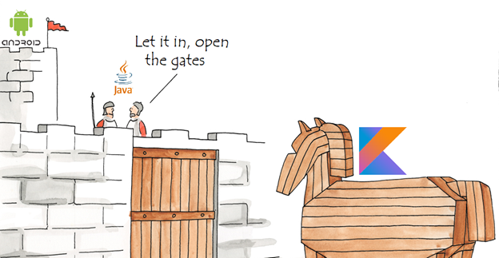

name: slide_section  
class: slide_section, center, middle
layout: true
{{content}}
---
name: slide_normal
class: slide_normal, left, top
layout: true
{{content}}
---

# Workshop: Kotlin



**IEEE UP SB** - Computer Society

---

## What is Kotlin?

The Kotlin programming language was released in 2016 by **JetBrains**.

Is designed to interoperate fully with **Java** and is a mix of object-oriented and functional programming, whereas Java is more limited to the concept of object-oriented programming.

Kotlin is used to develop Android apps, server side apps, and much more.

The name comes from Kotlin Island, near St. Petersburg. Andrey Breslav mentioned that the team decided to name it after an island, just like Java was named after the Indonesian island of Java.

---

## How to start?

Kotlin files used the `.kt` extension.

The entrypoint of a given file is the `main` function.

```kotlin
fun main() {
    // Code execution starts here
}
```

---

## Comments

There are two types of comments in Kotlin:

```kotlin
// Single line comment 
```

```kotlin
/* This is a multi-line comment. I'm writing this 
 * text to show you that we can write the comments
 * in multiple lines
 */
```

---

template: slide_section

# Variables

---

## Variable declaration

Kotlin uses two different keywords for variable declaration:

- `val` is used for variable whose value never changes during the code execution
- `var` is used for a variable that can be reassigned

In the example below, `count` is a variable of type `Int` that receives the value 10.

```kotlin
var count= 10
count = 15
```

In this example, `languageName` may not be reassigned, as doing so will result in an error.

```kotlin
val languageName: String = "Kotlin"
```

---

## Variable naming

The general rule for Kotlin variables are:

- Names can contain letters, digits, underscores, and dollar signs
- Names should start with a letter, *$* or *_* 
- Names are case sensitive (`myVar` and `myvar` are different variables)
- Names should start with a lowercase letter and it cannot contain whitespace
- Reserved words (like Kotlin keywords, such as `var` or `String`) cannot be used as names

---

## Type annotation

Unlike many other programming languages, variables in Kotlin do not need to be declared with a specified type, since it concludes a type variable from the given context.

However, if you declare a variable without assigning its value, you must specify its type, using Pascal notation `<name>: <type>`. 
This is called type annotation.

```kotlin
var name: String
name = "Eduardo"
```

This, in counterpart, will generate an error:

```kotlin
var name: String
name = "Eduardo"
```

---

## Data types

Basic Kotlin data types are divided into different groups:

- Integer (`Byte`, `Short`, `Int`, `Long`)
- Floating-point (`Float`, `Double`)
- Boolean (`Boolean`)
- Character (`Char`)
- String (`String`)
- Array (`Array`)

**Note:** Kotlin doesn't really have primite data types in its strict sense. Instead it has classes that act as wrappers for the JVM data types.

---

## Type checks

Using the `is` operator or its negated form `!is` it's possible to perform a runtime check that identifies whether an object conforms to a given type:

```kotlin
val name = "Eduardo"

name is String    // Will return true
name !is String   // Will return false
!(name is String) // Same as above
```

---

template: slide_section

# Input/Output

---

## Output

You can use `println()` and `print()` functions to send output to the standard output.

```kotlin
print("My name is")  // Doesn't print a newline
println("Eduardo")   // Prints a new line
```

The final result will be:

```c
My name is Eduardo
```

You can also use `${...}` statements to insert code inside string literals (essentially formatting them):

```kotlin
println("My name is ${name}")
```

---

## Input

To read a line of string in Kotlin, you can use `readline()` function.

```kotlin
print("Enter your name: ")  
val name = readLine()

print("Enter your name: ")  
val age = Integer.valueOf(readLine())  
```

As Kotlin is fully interoperable with Java, we may also use the `Scanner` class from Java's standart library.

```kotlin
import java.util.Scanner  

val age = read.nextInt()  
```

---

template: slide_section

# Flow control

---

## If expression

Kotlin supports the classical `if...else if...else` block structure.

```kotlin
if (a == b && a == c && b == c) {
    result = "Equilateral"
}

else if (a != b && a != c && b != c) {
    println("Scalene")
}

else {
    println("Isosceles") 
}
```

---

## If expression

Branches of `if` branches can be blocks. In this case, the last expression is the value of a block:

```kotlin
val max = if (a > b) {
    a
} 

else {
    b
}
```

This can be used to produce an equivalent to a ternary operator present in other languages:

```kotlin
val max = if (a > b) a else b
```

---

## When expression

`when` defines a conditional expression with multiple branches. It is similar to the switch statement in C-like languages. Its simple form looks like this:

```kotlin
when (x) {
    1 -> print("x == 1")
    2 -> print("x == 2")
    
    else -> {
        print("x is neither 1 nor 2")
    }
}
```

The `else` branch is evaluated if none of the other branch conditions are satisfied (similar to `default` in other languages).

---

## When expression

The `when` expression can also be used for variable assignment.

```kotlin
val color = when(fruit) {
    "Banana" -> "Yellow"
    "Strawberry" -> "Red"
    "Pear" -> "Green"
    "Peach" -> "Orange"
    ...
}
```

---

## When expression

By default, `when` branches compare to the inserted value by its equality. However, any kind of branch condition might be used instead. 

This essentially results in a simplified `if...else if...else` block. 

```kotlin
when {
    (temperature > 45) -> println("Too hot!")
    (temperature < -10) -> println("Too cold!")

    else -> println("Acceptable")
}
```

---

## For loops

Kotlin supports all the commonly used loops: `for`, `while` and `do-while`.

The typical `for` loop in Kotlin works like a `for each` of other languages, in which in iterates over the elements of a data structure, such as a list.

```kotlin
val cakes = listOf("carrot", "cheese", "chocolate")

for (cake in cakes) {                             
    println("Yummy, it's a $cake cake!")
}
```

---

## For loops

It is, however, possible to replicate a more typical `for` with the use of ranges.

```kotlin
for (i in 0..3)        // Inclusive
    print(i)

for(i in 0 until 3)    // Exclusive      
    print(i)

for(i in 2..8 step 2)  // Custom step  
    print(i)

for (i in 3 downTo 0)  // Reverse order
    print(i)
```

---

## While loops

`while` and `do...while` constructs work similarly to most languages as well.

```kotlin
var cakesEaten = 0
var cakesBaked = 0

do {                                       
    bakeACake()
    cakesBaked++
} while (cakesBaked < cakesEaten)

while (cakesEaten < 5) {                    
    eatACake()
    cakesEaten++
}
```

---

template: slide_section

# Functions

---

## Function declaration

Kotlin functions are declared using the `fun` keyword:

```kotlin
fun begins() {
    // ... 
}
```

<div align="center">
    
</div>

---

## Function parameters

Function parameters are defined using type annotation. 

Parameters are separated using commas, and each parameter must be explicitly typed, as well as the return value type:

```kotlin
fun powerOf(number: Int, exponent: Int): Int { 
    var result = number

    if (exponent == 0)
        return 1
    
    for (i in 1 until exponent)
        result *= number

    return result
}
```

---

## Shorter Syntax

There is also a shorter syntax for returning values.

You can use the `=` operator instead of `return` without specifying the return type.

```kotlin
fun add(x: Int, y: Int) = x + y
```

---

template: slide_section

# Arrays

---

## Array basics

Arrays are used to organize data in programming so that a related set of values can be easily sorted or searched.

Here are some basic properties of arrays –

- They are stored in contiguous memory locations.
- They can be accessed programmatically through their indexes (`array[1]`, `array[0]`, etc.)
- They are mutable.
- Their size is fixed.

---

## Array initialization

There are two ways to iniatilize an array in Kotlin.

Using the `arrayOf()` method:

```kotlin
val numbers = arrayOf(1, 2, 3, 4)   // Implicit type declaration
val numbers = arrayOf<Int>(1, 2, 3) // Explicit type declaration
```

Using the array constructor:

```kotlin
val numbers = Array(3, {i-> i*1})
```

---

### Accessing and modifying arrays

So far, we have seen how to create and initialize an array in Kotlin. Now, let’s see how to access and modify them.

### get() and set()

```kotlin
val x = numbers.get(0)
numbers.set(1, 3)
```

### Index operator

The `[ ]` operator can be used to access and modify arrays.

```kotlin
val x = numbers[0]
numbers[1] = 3
```

---

template: slide_section

# Classes

---

## Class declaration

Classes in Kotlin are declared using the keyword `class`:

```kotlin
class Car { 
    // ...
}
```

---

## Constructors

In Kotlin, a constructor is defined by using the `constructor` statement.

A class may have any number of different constructors. 


```kotlin
class Person { 
    private val name: String
    private val age: Int

    public constructor(name: String, age: Int) { 
        this.name = name
        this.age = age
    }
}
```

---

## Primary constructor

The primary constructor is a part of the class header, and it goes after the class name and optional type parameters.

```kotlin
class Person public constructor(
    firstName: String, 
    age: Int
) { /* ... */ }
```

If the primary constructor does not have any annotations or visibility modifiers, the constructor keyword can be omitted:

```kotlin
class Person(firstName: String, age: Int) { /* ... */ }
```

Any secondary cosntructors must call the primary constructor, if there is one.

---

## Constructors with named arguments

Kotlin constructors support named arguments, so parameters can be ommited if they have a default value.

```kotlin
class Person(
    firstName: String,
    lastName: String = "",
    age: Int
) { 
    // ...    
}

Person(firstName = "Eduardo", age = 21)
```

---

## *init* block

The `init` block is always called after the first constructor.

In it, you can use the values passed in the contructor.

```kotlin
class Person(firstName: String, age: Int) { 
    public val firstName: String
    public var canVote: Boolean
    
    init {
        this.firstName = firstName
        canVote = age > 18
    }
}
```
---

## Class properties

Class properties can be automatically initialized in the primary constructor, with no need to manually initialize in the `init` block.

```kotlin
class Person(public val firstName: String, age: Int) { 
    public var canVote: Boolean
    
    init {
        canVote = age > 18
    }
}
```

---

## Inheritance

Using the `open` keyword in front of the superclass/parent, this makes the class other classes should inherit properties and functions from.

To inherit from a class, the name of the subclass is specified, followed by a colon `:`, and then the name of the superclass.

```kotlin
open class Shape {
    open fun draw() { /* ... */ }
    fun fill() { /* ... */ }
}

class Circle() : Shape() {
    override fun draw() { /* ... */ }
}
```

---

template: slide_section

# Special Classes

---

## Data classes

Data classes makes it easier to create classes that are used to store values. 

Such classes are automatically provided with methods for copying, getting a string representation, and using instances in collections. 

```kotlin
data class User(val name: String, val id: Int) {           
    // ...           
}

val user = User("Alex", 1)
```

---

## Enum Classes

Enum classes are used to model types that represent a finite set of distinct values, such as directions, states, modes, and so forth.

```kotlin
enum class State {
    IDLE, RUNNING, FINISHED                           
}

fun main() {
    val state = State.RUNNING 
} 
```

---

## Sealed Classes

Sealed classes let you restrict the use of inheritance. 

Once a class is declared as sealed, it can only be subclassed from inside the same package where the sealed class is declared. 

It cannot be subclassed outside of the package where the sealed class is declared.

```kotlin
sealed class Mammal(val name: String)                                                   

class Cat(val catName: String) : Mammal(catName)                                       
class Human(val humanName: String, val job: String) : Mammal(humanName)
```

---

## Object expression

Object expressions create objects of anonymous classes, that is, classes that aren't explicitly declared with the class declaration.
Such classes are useful for one-time use.

```kotlin
val helloWorld = object {
    val hello = "Hello"
    val world = "World"
}
```

---

## Object declaration

`object` can also be use to declare *singleton* classes, that is, classes that should be instanced only once at a given moment.

```kotlin
object HelloWorld {
    val hello = "Hello"
    val world = "World"
}

val helloWorld = HelloWorld()
```

---

template: slide_section

# Null Safety

---

## Non-null types

In Kotlin, the type system distinguishes between references that can hold `null` (nullable references) and those that cannot (non-null references). 

For example, a regular variable of type `String` cannot hold null:

```kotlin
// Regular initialization means non-null by default
var a: String = "abc" 

// Compilation error
a = null              
```

---

## Nullable types

To allow nulls, you can declare a variable as a nullable type by adding a `?`:

```kotlin
var b: String? = "abc" // Can be set to null
b = null

print(b)
```

---

## Safe calls

Safe calls are a way to sure you don't access null values which would result in errors in a simple way.

```kotlin
var language: String? = "Kotlin"

println(language?.length)  // Prints 6

language = null

println(language?.length)  // Prints null
```

---

## Elvis operator

When you have a nullable reference, you can say "if it isn't null, use it, otherwise use some non-null value":

```kotlin
val l: Int = if (b != null) b.length else -1
```

Instead of writing the complete if expression, you can also express this with the Elvis operator `  ?:`:

```kotlin
val l = b?.length ?: -1
```

---

## The !! operator

The not-null assertion operator (`!!`) converts any value to a non-null type and throws an exception if the value is `null`. 

You can write `b!!`, and this will return a non-null value of `b`.

```kotlin
val l = b!!.length
```

In this case, if `b` is a `String`, it will return its length, otherwise, if it's null, it will throw an `NullPointerException`.

---

<div align="center">
    
</div>

```kotlin
while (hour != "17:30")
    if (questions?.length)
        ask(question)

    else
        doExercises()
```

---

template: slide_section

# Exercises

---

## Hello!

Create some Kotlin code that will prompt you to enter your name and age. 

Print out "Hello" and then the name followed by how old they'll be next year.

```md
input:
	Jorge
	21
output:
	Hello Jorge!
	Next year you'll be 22.
```

---

## Odd or even?

Write some code that checks whether or not a given number is odd or even and prints "Odd" or "Even" accordingly.

```md
input:
	3
output:
	Odd
```

---

## Octal

Implement some Kotlin code that converts a given number in base 10 to base 8 (octal) using at least one `while` loop.

```md
input:
	9
output:
	10
```

---

## Personal data

Write a class `Person` to store someone's personal information, such as their name, age, gender and address.

The class should have a `greet()` method to display in a human friendly way that same information.

### Extra

If you want to make this exercise more challenging, make the class receive the birthdate of the person in question and then calculate their age.

---

## Shapes

Define a class `Shape` and its subclasses `Triangle`, `Square` and `Circle`.

It should have an `area()` method that calculates the shape's area based on its dimensions and stores it in an attribute.

Override it for each subclass, adjusting the area formula for each kind of shape.